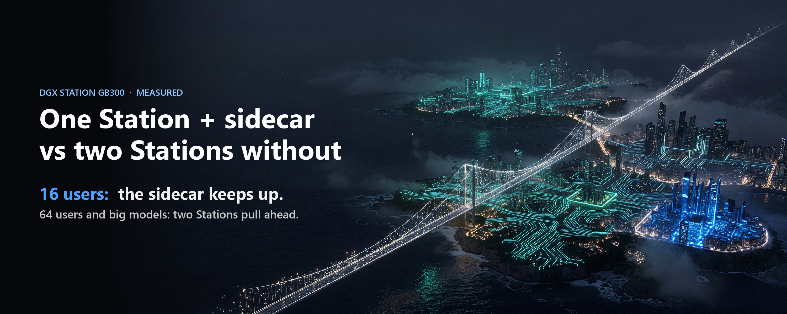
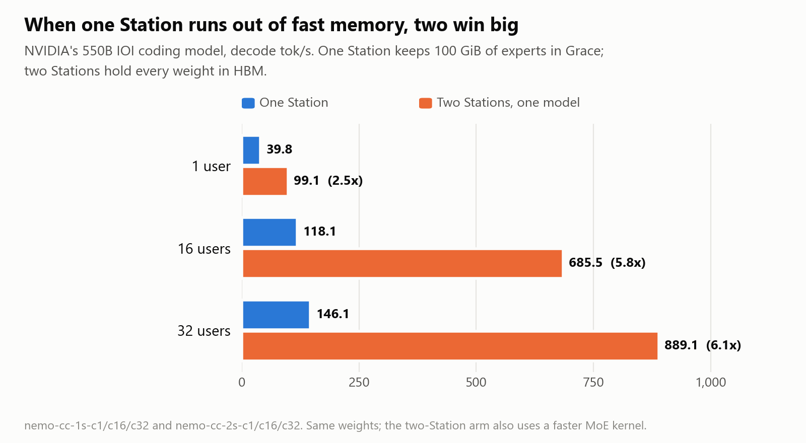

# One Station with a sidecar vs two Stations without

*Stephen J. Ronan, MD ([@SJRonanMD](https://x.com/SJRonanMD)), October 2026. First published as an [X Article](https://x.com/SJRonanMD/status/2108612518210080774).*

Two DGX Stations are more machine than one. They hold models one Station cannot, they serve more users, and run as two copies they deliver almost twice the total throughput. None of that is in question here.

The narrower question is what an RTX PRO 6000 sidecar is worth. With one in the open slot, one Station runs DeepSeek-V4.1-Flash at 1,807 to 1,995 tok/s with 16 users. The best published number for the same model split across two Stations without sidecars is 1,678. At 64 users the second Station pulls ahead: 3,402 for the pair against 3,047 to 3,160 for one Station with its sidecar.

Why a sidecar keeps up with a second Station at moderate load, and why it stops keeping up, says a lot about how to run either setup.

This question came out of conversations with fellow Station owner catid, who has been running two Stations together since August. Talking through his setup and ours is what made me want to know where each one wins, and why.

## The numbers

Three ways to run the same model, all on the same benchmark (8K random-token prompt, 1K tokens out):

- **One Station with a sidecar.** The GB300 holds the busy experts, the RTX PRO 6000 holds the rest.
- **Two Stations, one model split across both, no sidecars.** Each GB300 holds half of every layer.
- **Two Stations, one copy on each.** Two independent servers, with requests split between them.

The chart uses the slower of our two Stations for the one-Station bars. The split-model numbers are the best published ones we know of, from a different software build and drafter setup than ours, on a pair of Stations with two network links where ours have one. Treat the comparison as a fair picture of the shape, not a stopwatch race.

## What splitting a model costs

When one model spans two Stations, each GB300 does half of each layer's work. Before the next step can start, the two halves have to be combined, which means a message over the network. It happens again and again for every token.

We traced this on DeepSeek-V4-Pro across our two Stations. One generated token needed 123 of these combine steps. The typical one took about 20 microseconds. The messages are tiny, about 14 KB each, and the link can move 392 gigabits per second, so bandwidth is not the problem. Each message has a fixed cost to start, cross and finish, and the token waits for every one. Together they came to about 2.3 ms of pure transfer per token, and more in practice, because each Station also waits whenever the other is a little behind.

A sidecar pays nothing like that. The 6000 sits in the same box, its round trip overlaps with the GB300's own work, and on V4-Pro only 0.75 ms of a 22.6 ms step was exposed. (How the sidecar does that is the subject of my last article.)

That is the whole story at 16 users. Each step is small, so a fixed tax of network round trips is a big share of it. One Station with a sidecar skips the tax, and that is enough to keep up with a second GB300.

## Why two Stations win at 64

At 64 users each step is large. Every layer now has 64 tokens' worth of math, and the network tax is spread across all of them. What matters then is how much work the hardware can do per step and how many users it can fit at once.

Two GB300s have twice the compute and twice the HBM for the KV cache that every active user needs. One GB300 plus a 6000 that only holds the less-used experts has one GB300's worth of both. We also saw how tight one Station gets: running 64 users at all required capturing CUDA graphs for steps of up to 256 tokens, and without that, throughput fell by about half.

To be clear about what we have and have not proven: the 16-user side rests on measured network costs. The 64-user explanation is our reading of the numbers, not a profile of the split setup.

## The option that beats both

If you have two Stations and many users, you do not have to split one model. Run a full copy on each and send each request to one of them.

On our pair that gave 3,770 tok/s at 16 users, 4,548 at 32 and 5,774 at 64, between 1.7 and 2.25 times the best published split-model numbers. No single request ever uses both machines, though, so one user still gets one Station's speed. It is the right answer for throughput, and it uses both 6000s.

## When splitting is the right call

None of this means splitting is a mistake. It wins when a model does not fit one Station's fast memory.

NVIDIA's 550B IOI coding model is the example. On one Station, 100 GiB of its experts have to live in Grace memory, and it runs at 39.8 tok/s for one user. Split across two Stations, every weight fits in HBM, and it runs at 99.1, 2.5 times faster, and 6.1 times faster at 32 users. (The two-Station run also used a faster MoE kernel, so not all of that gain is the split.) DeepSeek-V4-Pro, at 1.6 trillion parameters, does not fit one Station at all, so for it two Stations are the only option.

## Which setup for which job?

![Decision guide. Model fits one Station (HBM plus a 6000): one Station with a sidecar, no network in the loop, best per-Station speed at moderate load. You have two Stations and many users: run one copy on each and split requests; each user gets one-Station speed and the total doubles. You need more than about 32 users on one model: splitting one model across both starts to pay. Model does not fit one Station's fast memory: split it; two HBMs beat one HBM plus Grace by 2.5x for one user in our test. You care most about one user's speed: avoid the split if the model fits, because every layer adds network round trips.](img/4-guide.png)

- If the model fits one Station with a sidecar, start there. No network in the loop.
- If you have two Stations and many users, run two copies before you split one model.
- Split one model across both when it does not fit one Station's fast memory, or when one model has to serve more users than one Station can hold.

Thanks to catid for the conversations that started this. Every number above is in the public repo with its log:
[github.com/RonanLabsAI/dgx-station-frontier](https://github.com/RonanLabsAI/dgx-station-frontier)

Published two-Station figures: [github.com/catid/dgx_station_benchmarks](https://github.com/catid/dgx_station_benchmarks).

## Sources for every number

Rows are in [`results.jsonl`](../../results.jsonl). Published two-Station figures are the `pub-*` rows, quoted from
[catid/dgx_station_benchmarks](https://github.com/catid/dgx_station_benchmarks) @`ff8a496e`; nothing is copied from that repo.

| Number in the article | Receipt |
|---|---|
| One Station + sidecar: 16 users 1,807-1,995; 32 users 2,261; 64 users 3,047-3,160 | `dsv41-solo-left-c16`, `dsv41-solo-right-c16`, `dsv41-solo-left-c32`, `dsv41-solo-right-c64`, `dsv41-solo-left-c64` |
| Two Stations, one model, no sidecars: 1,678 / 2,117 / 3,402 | `pub-catid-pp2-c16` (best two-Station 16-user figure), `pub-catid-tp2-c32`, `pub-catid-tp2-c64`; their setup used two 400G links |
| Two copies: 3,770 / 4,548 / 5,774; 1.7-2.25x | `dsv41-dp2-total-c16`, `-c32`, `-c64`; `ratio-dp2-over-catid-c16`, `-c32`, `-c64` |
| 123 combine steps per token, about 20 µs each, about 2.3 ms transfer | `dsv4pro-e3a16-c1-allreduce` (notes) |
| About 14 KB per message; 392 Gb/s link | V4-Pro hidden 7,168 x 2 bytes; `fab-gdr-bw` |
| Sidecar exposed 0.75 of 22.6 ms | `dsv4pro-e3a16-c1-sidecar-cost`, `dsv4pro-e3a16-c1-step` |
| 64 users needs CUDA graphs to 256 tokens | [`recipes/dsv41-flash-sidecar/`](../../recipes/dsv41-flash-sidecar/) flags table |
| IOI model 39.8 / 99.1, 118.1 / 685.5, 146.1 / 889.1 | `nemo-cc-1s-c1`, `-c16`, `-c32`; `nemo-cc-2s-c1`, `-c16`, `-c32`; [`recipes/nemotron-ultra/`](../../recipes/nemotron-ultra/) |

Figures: drawn from the values above. Cover art generated with Grok Imagine; title set by us.
