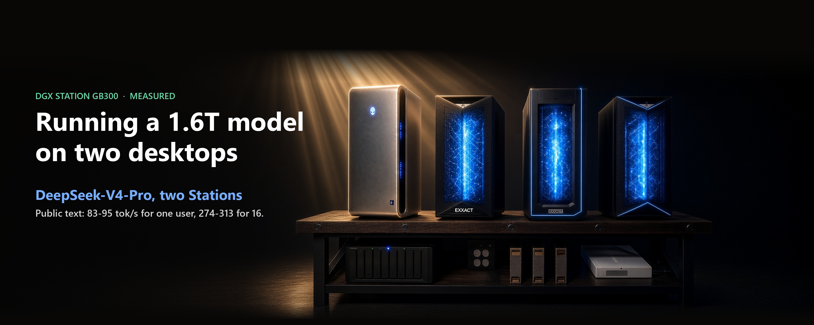

# Running a 1.6T model on two desktops

*Stephen J. Ronan, MD ([@SJRonanMD](https://x.com/SJRonanMD)), October 2026. First published as an [X Article](https://x.com/SJRonanMD/status/2108958015156269416).*

DeepSeek-V4-Pro has 1.6 trillion parameters and 893 GB of weights as DeepSeek released them. At that precision one DGX Station GB300 cannot hold it, so we split it across two. On public text it now serves one user at 83 to 95 tokens a second and 16 users at 274 to 313 tokens a second in total, with 98% on a math test and every quality check passing. Stock vLLM on the same two Stations started at about 38 tokens a second for one user in our first tests.

We were not the first to run it on a Station. In August, Salvatore Sanfilippo (antirez) ran a 2-bit quantization of V4-Pro on one DGX Station in his DwarfStar engine at 45 to 50 tokens a second. We wanted the weights at their released precision [MXFP4 experts, FP8 elsewhere], served by vLLM to 16 users at once, and that takes both Stations.

This is how we got there: what each step bought, the hang that nearly sank the fastest one, and where the time goes now.

## The result, on text anyone can rerun

The prompts are public: CNN/DailyMail news articles about 8,000 tokens long, and first turns from ShareGPT chats, each with thinking off and on. The map that decides which experts live where was fitted on separate public prompts only, and no measured prompt was used to fit it. So anyone with two Stations and our repo can rebuild the map and rerun the test.

- **One user:** 83 to 95 tokens a second, the mean of three runs. Chat prompts vary the most, from 76 to 112 between runs with thinking off, because the drafter's hit rate depends on the prompt.
- **16 users:** 274 to 313 tokens a second in total.
- **Quality:** 98% on GSM8K, the sidecar matches the stock path to a cosine of 0.99999, no sidecar timeouts, and no prefix-cache hits on any run.

The RTX PRO 6000 sidecars, one per Station, add 25 to 29% for one user and 53 to 61% at 16 users. That comparison is two separate boots about an hour apart in the same session, the same map and stack, with the sidecars on and off. On random token ids they add only 8%, because random ids spread evenly over all experts and no warm tier helps much.

## The ladder

We climbed one change at a time on a private set of 36 held-out prompts (thinking off, 1,024 tokens out), with a math check and a numerics check after every change. Those prompts and the maps fitted to them stay private, so these rungs show the direction, and the public run above is the number to quote.

1. **Stock vLLM.** The model is split across both Stations [tensor parallel 2, expert parallel 2] over one 400G link. About 200 GiB of experts per Station sit in Grace memory, which the GPU reads over the C2C link. 37.9 tokens a second for one user, 114.9 for 16, 98.0% on GSM8K-200.
2. **Hot experts in HBM.** We logged which experts real traffic uses and pinned the busiest ones in the GPU's own memory: 40.5 and 152.0. The hook behind it is J-M-Recipes' pin-hot-experts, ported to vLLM's Marlin path.
3. **Sidecars.** 2,400 warm experts per Station move to the RTX PRO 6000 in the same box: 43.9 and 230.8, GSM8K 97.5%.
4. **A drafter.** DeepSeek ships a small model that guesses ahead: 77.6 for one user. Then it hung.
5. **Hang fixed:** 76.5 and 298.3, GSM8K 97.5%.
6. **Skip wasted drafts:** 76.6 and 303.6, GSM8K 98.0%.

On random token ids, which anyone can reproduce, steps 1 to 3 go from 37.8 to 37.6 for one user and from 109.5 to 164.6 for 16. Random ids hide most of what a usage map buys.

## Six memory tiers, one model

Each Station holds half of every layer's experts, in three places: the 5,568 busiest in GB300 HBM next to the dense weights and the KV cache, 2,400 warm ones on the RTX PRO 6000, and the 3,744 coldest in Grace. Two Stations make six tiers serving one model.

The sidecar receives only the tokens routed to its experts and sends the results back while the GB300 works on its own share. In a traced single-user step it cost 0.76 ms of 22.6. My earlier article, [What does an expert sidecar actually do?](../what-does-an-expert-sidecar-do/), covers how.

## Why the drafter doubles real text and not random tokens

The drafter guesses five tokens ahead, and the big model checks them all in one step. On real text it is right often enough that each step yields about 2.9 tokens. On random token ids it yields about 1.02, so almost every guess is wasted.

A drafting step takes about 38 ms against 22.6 ms without one, so drafting pays above roughly 1.7 tokens per step. Real text clears that easily. Random ids do not: before the fix, the drafter cut random-token speed from 37.6 to 21.6 for one user.

Skipping wasted drafts fixes that. The scheduler already tells every worker how many drafts the next step will check. When that number is zero, the worker skips the draft pass and keeps only the bookkeeping the drafter needs later. The decision comes from the scheduler's broadcast, so both Stations always make it together. In a same-session test, skip-draft took random-token speed from 29.7 to 37.1 for one user (+25%), and on real text the difference stayed inside run-to-run noise.

## The hang

The drafter doubled single-user speed, then froze both Stations seconds into a GSM8K run with thinking on.

Rank 1, the second Station, ran out of GPU memory while loading a drafter kernel for the first time. The server was set to use 99% of memory, and that kernel had never been needed until GSM8K's short, staggered prompts produced a batch shape the benchmarks never had. vLLM reports errors to the engine only from rank 0. On rank 1 it logged the exception and moved on to the next step.

So rank 1 skipped the drafter's all-reduces and walked into the next step's, while rank 0 sat in the drafter waiting for a partner. Each Station waited for the other, across the link, until the engine timed out five minutes later. The counters gave it away: rank 1 was exactly three layers ahead.

The fix has three parts:

- An exception on any rank now ends that worker, so the engine dies loudly in about two minutes instead of hanging.
- The drafter's kernels are compiled and loaded at boot, not in the middle of serving.
- The KV cache gets a fixed size, which leaves memory free on each GPU.

With the fix, GSM8K-200 finished at 97.5%, and a 30-minute mixed soak test finished with no timeouts. Both root causes are open vLLM issues, [#60928](https://github.com/vllm-project/vllm/issues/60928) and [#60929](https://github.com/vllm-project/vllm/issues/60929).

## Proving it holds

A fast setup that falls over under load is no use, so the final stack had to pass three more tests before we called it production.

- **A 20-minute soak at 16 users, with a streaming client:** 801 of 801 requests completed, no timeouts, no hangs, no errors. The longest request ran 313 seconds, a long thinking answer on GSM8K. Our earlier client gave up after 240 seconds and counted two such requests as failures. The engine was fine, but the test was not.
- **Flips:** a flip is a token where the model's top choice differs from a stock reference run, and stock vLLM on this path flips 3.22% against itself. Skip-draft on and off in the same session gave 3.66% and 3.64%, so skip-draft does not add flips. The 4.62% we saw earlier was noise.
- **Numerics:** every layer on both Stations matches the stock path to a cosine of 0.99999.

## Where a single-user step goes

We traced one request on both Stations at step 3, with the sidecars and before the drafter. The step is 22.6 ms. Almost half of it, 10.6 ms, is small kernels: hundreds of short matrix multiplies, the hyper-connection mixing and the norms, each too small to keep the GPU busy.

Grace costs 5.5 ms on the critical path, though each Station spends only 3.3 to 3.5 ms reading it. A cold expert on one Station stalls the other at the next all-reduce, and almost every step hits Grace somewhere. The network itself moves 123 small messages per token in about 2.3 ms, so by our estimate a faster all-reduce would save at most about 0.7 ms.

The map matters too. Ours was first fitted to thinking-on traffic, while the benchmark ran thinking off, and the step read far more cold experts than the map predicted. The expert map has to match the traffic you actually serve, which is why the public-text run uses a map fitted on public text, and why the repo shows how to rebuild it.

## What is next

- **Fewer, bigger kernels.** Group the per-layer projections into one matrix multiply, fold quantization into it, and fuse the mixing with the norm. That is an estimate until a microbenchmark says otherwise.
- **A map for the real traffic mix**, gated on GSM8K and flips before it serves anything.
- **The second network rail.** More bandwidth helps long prompts, not one user's decode.

Two ideas to balance Grace reads across the Stations, copying cold experts to both and rerouting cold picks, failed in simulation, so we dropped them. The design for a peer-device expert tier in vLLM is open as RFC [#60932](https://github.com/vllm-project/vllm/issues/60932), and the b12x kernel fix the sidecar needs is FlashInfer PR [#6294](https://github.com/flashinfer-ai/flashinfer/pull/6294).

## Credits

The sidecar design is original-el8's (Jason Cook). The 6000's kernels are b12x from Local Inference Lab. The HBM pinning in step 2 started from J-M-Recipes' pin-hot-experts hook (James Meadlock). DeepSeek made the model and the drafter that ships with it, and all of it runs on vLLM.

Thanks to antirez for showing first that a Station can run this model. Every public number above is in this repo with its log, along with the scripts to rebuild the public map: see [`recipes/dsv4-pro-two-stations/`](../../recipes/dsv4-pro-two-stations/).

## Sources for every number

Rows are in [`results.jsonl`](../../results.jsonl); the recipe and its tables are in
[`recipes/dsv4-pro-two-stations/`](../../recipes/dsv4-pro-two-stations/).

| Number in the article | Row id(s) |
|---|---|
| Public text, one user 83-95; 16 users 274-313 | `dsv4pro-clean1009-pubmap-{cnn,sharegpt}-think-{off,on}-c1`, `-c16` |
| Chat prompts, thinking off, 76-112 between runs | `dsv4pro-clean1009-pubmap-sharegpt-think-off-c1-r1`, `-r2`, `-r3` |
| GSM8K 98%, cosine 0.99999, no sidecar timeouts, no prefix-cache hits | `dsv4pro-clean1009-pubmap-gsm8k50`, `-cos-min`, `-sidecar-timeouts`, `-public-prefix-hit` |
| Sidecars add 25-29% (one user), 53-61% (16 users), 8% on random ids | `dsv4pro-clean1009-sidecar-gain-*`; off arm `dsv4pro-clean1009-pubmap-off-*` |
| 893 GB of weights; about 200 GiB of experts per Station in Grace | recipe README (892.8 GB); `dsv4pro-e1-grace-offload` |
| Steps 1-3 (private prompts): 37.9 / 114.9, 40.5 / 152.0, 43.9 / 230.8; GSM8K | `dsv4pro-e1-real-c1`, `-c16`, `-gsm8k200`; `dsv4pro-e2-real-c1`, `-c16`; `dsv4pro-e3a16-real-c1`, `-c16`, `-gsm8k200` |
| Random ids, steps 1-3: 37.8 to 37.6 (one user), 109.5 to 164.6 (16) | `dsv4pro-e1-catid-c1`, `-c16`; `dsv4pro-e3a16-catid-c1`, `-c16` |
| Step 4, drafter: 77.6 / 270.9, hung; random ids 21.6 | `dsv4pro-dspark-real-c1`, `-c16`, `-catid-c1`, `dsv4pro-dspark-gsm8k-errors` |
| Step 5, hang fixed: 76.5 / 298.3, GSM8K 97.5%, 30-minute soak with no timeouts | `dsv4pro-dspark-guard-real-c1`, `-c16`, `-gsm8k200`, `-soak-timeouts` |
| Step 6, skip wasted drafts: 76.6 / 303.6, GSM8K 98.0% | `dsv4pro-dspark-skipdraft-real-c1`, `-c16`, `-gsm8k200` |
| Skip-draft on random ids 29.7 to 37.1 (+25%) | `dsv4pro-dspark-final-catid-c1-skipdraft-off`, `dsv4pro-dspark-final-catid-c1` |
| Soak 801 of 801, longest request 313 s; earlier client's two "timeouts" | `dsv4pro-dspark-final-soak-ok`, `-soak-timeouts`; `dsv4pro-dspark-skipdraft-soak-timeouts` |
| Flips 3.22% floor; 3.66% vs 3.64%; earlier 4.62% | `dsv4pro-e1-flip-floor`; `dsv4pro-dspark-final-flips-skipdraft-on`, `-off`; `dsv4pro-dspark-skipdraft-flips` |
| Every layer matches to 0.99999 | `dsv4pro-dspark-final-cos-min` |
| 5,568 / 2,400 / 3,744 experts per Station | recipe README stage table (3,744 = 61 x 192 - 5,568 - 2,400) |
| Step 22.6 ms: small kernels 10.6, Grace 5.5 (3.3-3.5 per Station), HBM 3.2, network 2.3 (123 all-reduces), idle 0.95, sidecar 0.76 | `dsv4pro-e3a16-c1-step`, `-small-kernels`, `-grace-experts`, `-hbm-experts`, `-allreduce`, `-gpu-idle`, `-sidecar-cost` |
| Drafter 2.9 tokens per step on real text, 1.02 on random ids; about 38 ms per drafting step | `dsv4pro-dspark-real-c1` notes; computed from 2.9 / 77.56 tok/s |
| Faster all-reduce saves at most about 0.7 ms | our estimate from the step trace, not a measurement |

Figures: drawn from the values above. Cover: an image of our rig generated with Grok, title set by us.

