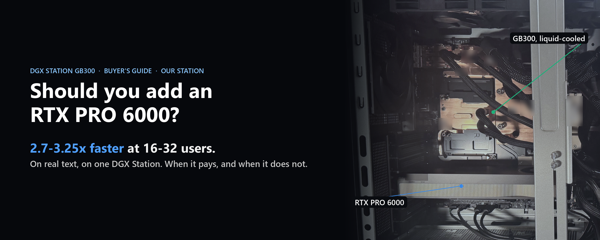
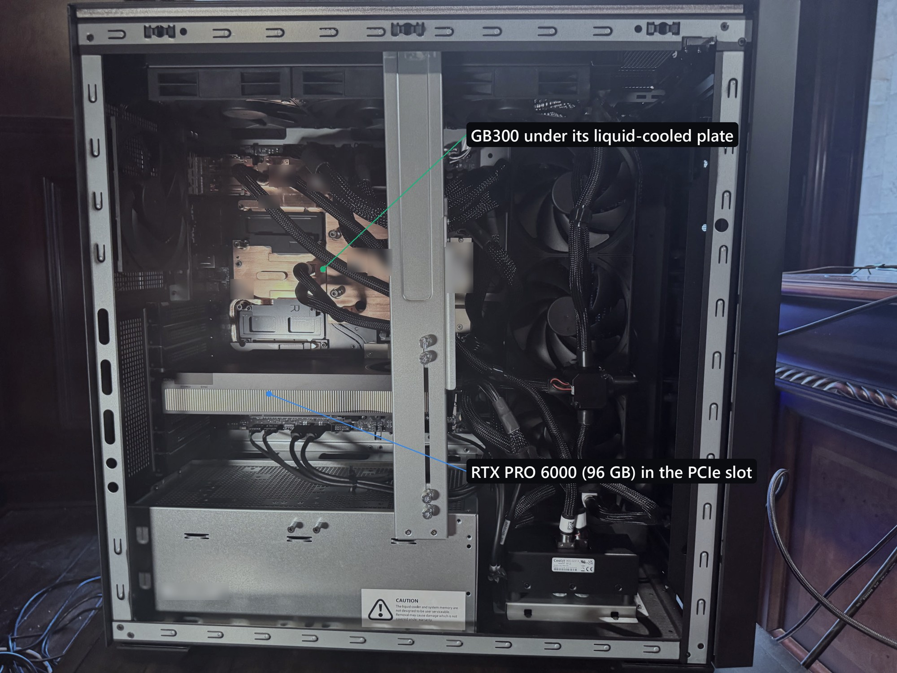
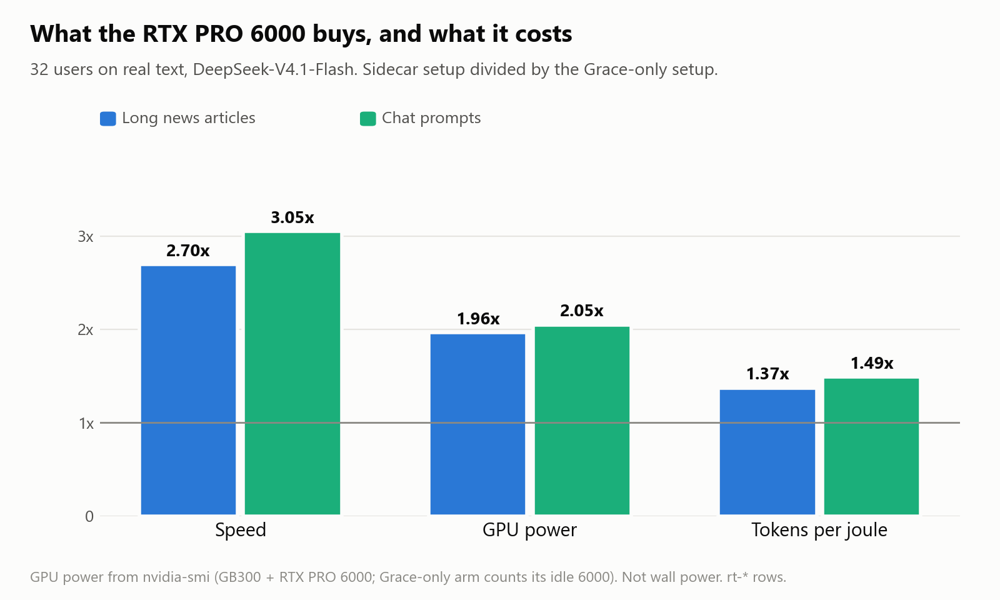

# Should you add an RTX PRO 6000 to your DGX Station?

*Stephen J. Ronan, MD ([@SJRonanMD](https://x.com/SJRonanMD)), October 2026. First published as an [X Article](https://x.com/SJRonanMD/status/2109012650369888443).*

Short answer: if you run big mixture-of-experts models that do not fit in the Station's GPU memory, and more than one person uses them, yes.

On real text, DeepSeek-V4.1-Flash ran 2.7 to 3.25 times faster at 16 and 32 users with an RTX PRO 6000 in the open slot, and 1.7 to 1.9 times faster for one user. That is against the same model with the same experts read from the Station's CPU memory instead, on the same Station, in the same session.

Here is what the card does, what it costs in power, when it pays and when it does not.

## What the card does

A DGX Station has one big GPU, the GB300, with about 250 GiB of fast memory. The biggest open models do not fit in it, so the experts they use least have to live somewhere else. The usual place is the Grace CPU's memory, which the GPU can read, but much more slowly.

An RTX PRO 6000 can hold those experts instead, in its own 96 GB, and do their math itself. The GB300 sends it the token, not the expert's weights, and keeps working while the 6000 does its part. That design is Jason Cook's (el8). How it works step by step is in my earlier article, [What does an expert sidecar actually do?](../what-does-an-expert-sidecar-do/)

## What it buys, and what it costs

At 32 users:

- **Speed:** 2.70 times faster on long news articles, 3.05 times on chat prompts.
- **GPU power:** about twice as much. The 6000 adds around 190 W, and the GB300 itself works harder because it is no longer waiting on slow memory: 810 W against 495 W on the news prompts.
- **Energy per token:** 1.37 to 1.49 times more tokens per joule. You pay more watts, but you get more work out of each one.

These are GPU readings from the driver, not power at the wall. I will measure the whole machine separately.

For one user the speed gain is smaller, about 1.7 to 1.9 times on real text. One user's step touches few experts, so slow memory matters less.

## When it pays

![Decision guide. Does your model spill out of HBM? If not, skip the 6000 for this model. Does it fit in HBM plus the 6000 plus Grace on one Station? Yes: one Station with a sidecar; no: two Stations or a lower-bit version. Do you serve more than one user? The gain is about 1.7 to 1.9x for one user and 2.7 to 3.25x at 16 to 32 users on real text. Is your bottleneck one user's speed on a model split across two Stations? Then the 6000 adds little, 6 to 8 percent on V4-Pro. Is there a sidecar recipe for it? Yes today for DeepSeek-V4.1-Flash, DeepSeek-V4-Pro and MiMo-V2.6-Pro (el8's); others need porting.](img/3-guide.png)

- **The model has to spill out of HBM.** If it fits in the GB300's own memory, the 6000 has nothing to hold for it.
- **More users, bigger gain.** Each extra user touches more distinct experts per step, so the slow-memory penalty grows and so does what the 6000 saves.
- **Less so for one user on a split model.** On DeepSeek-V4-Pro, a 1.6-trillion-parameter model we run across two Stations, the 6000s added 52% at 16 users on real text but only 6 to 8% for one user. At one user that model's time goes to hundreds of tiny GPU kernels and network round trips between the Stations, and no memory tier touches those.
- **Someone has to have written the recipe.** Today there are working sidecar recipes for DeepSeek-V4.1-Flash and DeepSeek-V4-Pro (ours, public), and for MiMo-V2.6-Pro (el8's, public). We are testing Kimi K3 next. Other models need the hook ported.

## A sidecar or a second Station?

They do different jobs. At 16 users, one Station with a sidecar ran DeepSeek-V4.1-Flash at 1,807 to 1,995 tokens a second, against 1,678 for the best published number with the model split across two Stations without sidecars. At 64 users the second Station pulls ahead.

A second Station is more machine. It holds models one Station cannot, serves more users, and run as two copies it nearly doubles total throughput: 5,774 tokens a second at 64 users on our pair. A 6000 makes one Station a lot better at the models it can already hold. The details are in [One Station with a sidecar vs two Stations without](../one-station-with-a-sidecar-vs-two-without/).

## If you do it

A few things that cost us time:

- **One GPU per process.** On our Stations, one program could not drive both the GB300 and the 6000. The sidecar design already runs the 6000 in its own process.
- **Attach GPUs to containers as CDI devices**, not with Docker's `--gpus` flag. A routine system update otherwise cut our running containers off from their GPUs.
- **If you also use Grace memory, pin it.** The GPU reads pinned Grace memory at 353 GB/s and managed memory at 91 GB/s.
- **Use the public kernel fix.** The b12x kernels the sidecar runs had a bug that returned NaN when some experts were masked out. Our fix is filed with FlashInfer: [flashinfer-ai/flashinfer#6294](https://github.com/flashinfer-ai/flashinfer/pull/6294)
- **Power is not a worry.** Neither GPU came near its power limit in any of our runs. The RTX PRO 6000 Max-Q is capped at 300 W.
- **It is useful between jobs.** When ours are not serving as sidecars, they run smaller models of their own.

## Bottom line

If your models spill out of the GB300's memory and you serve more than one person, an RTX PRO 6000 is the biggest single speed-up we have measured on one Station. If they fit, or one user's speed on a split model is all you care about, spend the money elsewhere.

Recipes, logs and every number above are in this repo; sources below.

Credit to Jason Cook (el8) for the sidecar design and Local Inference Lab for the b12x kernels.

## Sources for every number

Rows are in [`results.jsonl`](../../results.jsonl); the real-text comparison is in [`results/sidecar-ab.md`](../../results/sidecar-ab.md).

| Number in the article | Row id(s) |
|---|---|
| Real text 2.7-3.25x at 16-32 users, 1.7-1.9x for one user | `rt-ratio-long-c1-decode`, `-c16-decode`, `-c32-decode`; `rt-ratio-short-c1-decode`, `-c16-decode`, `-c32-decode` |
| Speed 2.70x / 3.05x at 32 users | `rt-ratio-long-c32-decode`, `rt-ratio-short-c32-decode` |
| GPU power 1.96x / 2.05x | `rt-a-long-c32-total-power-mean` / `rt-b-long-c32-total-power-mean-incl-idle-rtx`; `rt-a-short-c32-total-power-mean` / `rt-b-short-c32-total-power-mean-incl-idle-rtx` |
| The 6000 adds about 190 W; GB300 810 W vs 495 W | `rt-a-long-c32-rtx-power-mean`, `rt-a-short-c32-rtx-power-mean`; `rt-a-long-c32-gb300-power-mean`, `rt-b-long-c32-gb300-power-mean` |
| Tokens per joule 1.37x / 1.49x | `rt-a-long-c32-decode-tok-per-j` / `rt-b-long-c32-decode-tok-per-j-incl-idle-rtx`; `rt-a-short-c32-decode-tok-per-j` / `rt-b-short-c32-decode-tok-per-j-incl-idle-rtx` |
| DeepSeek-V4-Pro: +52% at 16 users, +6-8% for one user | `dsv4pro-e3-vs-e2-real-c16`; `dsv4pro-sidecar-ab-real-c1-gain`, `dsv4pro-sidecar-ab-catid-c1-gain` |
| 1,807-1,995 vs 1,678 at 16 users; 5,774 at 64 users (two copies) | `dsv41-solo-left-c16`, `dsv41-solo-right-c16`; `pub-catid-pp2-c16`; `dsv41-dp2-total-c64` |
| Pinned Grace 353 GB/s vs managed 91 GB/s | `atlas-c2c-zerocopy-read`, `atlas-managed-remote-read` |
| 6000 Max-Q capped at 300 W | `atlas-rtx-power-limit` |
| Recipes | [`recipes/dsv41-flash-sidecar/`](../../recipes/dsv41-flash-sidecar/), [`recipes/dsv4-pro-two-stations/`](../../recipes/dsv4-pro-two-stations/); MiMo-V2.6-Pro: original-el8's public repo |

Figures: drawn from the values above. Cover and first image: our own photo, with serial numbers and ID codes blurred.

