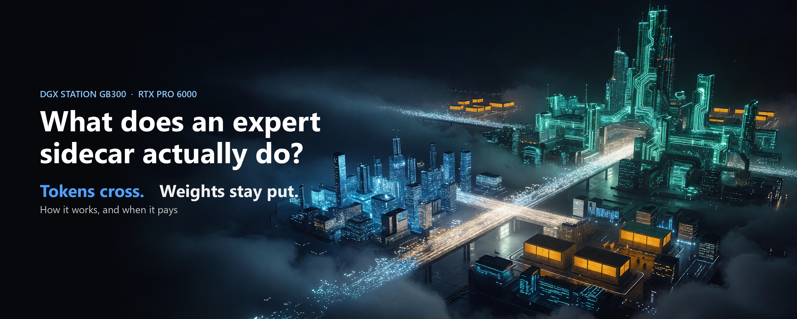

# What does an expert sidecar actually do?

*Stephen J. Ronan, MD ([@SJRonanMD](https://x.com/SJRonanMD)), October 2026. First published as an [X Article](https://x.com/SJRonanMD/status/2108603287876633022).*

When I shared how fast we had DeepSeek-V4-Pro running across our two Stations, fellow Station owner catid asked the obvious question in our owners' group chat: what does the sidecar actually do? Fair. I used the word a lot and never opened the box. Here is the box, and what we added to it.

Short answer: a second GPU in the same machine keeps its own copy of some of the model's experts. When a token needs one of them, the main GPU sends over the token, not the expert. The second GPU does that part of the math and sends the answer back, while the main GPU gets on with its own experts. The weights never move.

## Why there is a spare GPU at all

A DGX Station GB300 has one big GPU with about 250 GiB of fast HBM, a Grace CPU with about 494 GiB of slower memory, and an open PCIe slot. We put an RTX PRO 6000 (96 GB) in that slot.

Big mixture-of-experts models do not fit in HBM. DeepSeek-V4.1-Flash has 384 experts in each MoE layer, and each token uses 6 of them. The usual fix is to keep the busy experts in HBM and leave the rest in Grace memory, where the GPU reads them over NVLink-C2C at 353 GB/s. That works, but every time a token touches a Grace expert, that expert's weights have to cross the link.

The sidecar gives those experts a different home: the 6000's own memory.

## What happens in one layer

This design is Jason Cook's (el8), published in September with the kernels from b12x (Local Inference Lab). Here is one MoE layer, step by step.

1. The router picks 6 experts for each token. A fixed map says which experts live on the GB300 and which live on the 6000.
2. The GB300 packs only the tokens that picked a 6000 expert: their activations, which of the 6000's experts they picked, and the routing weights. It writes them into a shared buffer in pinned Grace memory and raises a flag.
3. The GB300 immediately starts on its own experts.
4. Meanwhile the 6000, running as its own process, sees the flag, copies the rows in, runs its experts with b12x's fused MoE kernel, writes the results back and raises its own flag.
5. When the GB300 finishes its own experts, it checks the flag. Usually the 6000 is already done. It adds the 6000's results back into each token and moves to the next layer.

Two details make this fast enough to use. Every GB300 step is a GPU kernel with no CPU in the loop, so the whole thing fits inside vLLM's CUDA graphs. And if the 6000 ever misses a deadline, the layer drops its contribution and a counter goes up instead of the server hanging. In our runs that counter stayed at zero.

## What crosses the wire

For DeepSeek-V4.1-Flash a token's activations are 5,120 numbers. Sent as 8-bit values, that is about 5 KB out per token per layer, and about 10 KB back. One expert's weights are about 19 MB. So for each expert use, the sidecar moves kilobytes where the Grace path moves megabytes, which is why a 55 GB/s PCIe link is enough.

The 6000 holds the 99 least-used experts of each of the model's 40 layers, about 74 GiB. Nothing about them ever travels.

## Why the GB300 almost never waits

The trick only works if the 6000 finishes its part before the GB300 finishes its own. el8 measured the 6000's time per layer: about 74 microseconds for a single row and 156 for a batch of up to 16 rows. That fits under the GB300's own expert work most of the time.

It is also easy to break. el8 found that the 6000's kernels had first been tuned on empty work, which made some batch sizes two to three times too slow. At 16 users the GB300 then waited 2.5 ms per step. After retuning on realistic rows the wait fell to 0.12 ms. Same hardware, same design, tuned properly.

We traced the two-Station version on DeepSeek-V4-Pro (1.6T parameters). Of a 22.6 ms single-user step, the sidecar's exposed cost was 0.75 ms. The rest of its work ran under the GB300's own expert calls.

## Is the answer still right?

A faster wrong answer is worthless, so every boot gets checked. The server can compare the sidecar's output for each layer against the reference path on the same experts. On DeepSeek-V4.1-Flash, on a real prompt, the worst layer matched at a cosine of 0.99977. On V4-Pro it was 0.999992, GSM8K-200 stayed at 97.5%, and the sidecar timed out zero times.

The bring-up check has its own trap. vLLM's start-up run feeds the model all-zero inputs and uses up a small check budget before any real prompt arrives. Set the budget high or you check nothing.

## What we added

el8 built the sidecar and proved it on one Station with DeepSeek-V4.1-Flash. Everything above is his design. We took it further.

![Comparison table. el8's published work: one Station and one 6000, DeepSeek-V4.1-Flash, HBM plus 6000 tiers, W4A8 kernels (his September write-up used an unreleased b12x branch), timeout plus counter, up to 32 users. RonanLabs, October 2026: two Stations running one model with a 6000 sidecar on each, DeepSeek-V4-Pro at 1.6T parameters, six memory tiers serving one model, public b12x plus W4A16 and a b12x bug fix, a handshake that refuses a mismatched sidecar, 64 users on one Station at 3,047 to 3,160 tok/s, and a same-session on/off A/B with power and an in-serving trace.](img/5-advances.png)

- **Two Stations, one model, a sidecar on each.** DeepSeek-V4-Pro has 1.6 trillion parameters, too big for one Station at its released precision. We split it across both and gave each GB300 its own 6000 holding the 2,400 warmest experts that did not fit in HBM. That is six memory tiers serving one model: two HBMs, two 6000s and two Graces. Others have run V4-Pro on less hardware: antirez ran a 2-bit version on a single Station in August. Ours runs the released precision in vLLM across two Stations, serving 16 users at once.
- **A sidecar that matches the reference path.** We send 16-bit rows instead of 8-bit ones, so the 6000 can run the same W4A16 math as vLLM's own kernel. The two agree to a cosine of 0.999992.
- **A bug fix in b12x.** On V4-Pro's expert shapes, b12x's W4A16 path returned NaN: when some routes were masked out it summed rows it had never written. The fix is a few lines, it is in the repo, and it is going upstream to FlashInfer, where b12x now lives.
- **A handshake.** A sidecar loaded with a different expert map would silently compute the wrong experts. In our version the GB300 checks the sidecar's map before it trusts it, and refuses a mismatch.
- **Public code, more users.** el8's V4.1 recipe runs on public b12x code in our setup, and with 64 sequences and larger CUDA graphs one Station reaches 3,047 to 3,160 tok/s at 64 users.
- **Receipts.** The same-session on/off comparison, power for both arms, and a trace of where a V4-Pro step's time goes.

On V4-Pro the sidecars took 16-user throughput on real text from 152 to 231 tok/s with the same quality. Our faster single-user V4-Pro numbers come from adding a speculative-decoding drafter on top; that is a story for its own article.

## When it pays

We switched the sidecar on and off in the same session on two models.

On DeepSeek-V4.1-Flash, one Station, the 6000 holds the cold tail. With it, decode was 1.97x faster for one user and 2.8x faster at 16 and 32 users than reading the same experts from Grace.

On DeepSeek-V4-Pro across two Stations, the model is far bigger than the 6000s, so they hold a middle tier of warm experts and Grace keeps the long tail. There the sidecars added 52% at 16 users on real text and 39% on random tokens, but only 6 to 8% for one user. At one user that model's step is mostly hundreds of tiny kernels and network round trips between the Stations, and no memory tier touches those.

Does it hold on real traffic? We checked with public news articles and real chat prompts, same Station, same session. The sidecar was 2.7 to 3.25 times faster at 16 and 32 users and 1.7 to 1.9 times faster for one user. Real text sent 11 to 21% of routes to the 6000's experts, about as many as random tokens do, so the earlier worry that real traffic would barely touch them did not hold up.

## Will it pay for your model?

So, catid: the sidecar is a second expert server inside the same box. It trades megabytes of weight traffic for kilobytes of token traffic, and it runs in parallel with the GB300 instead of in front of it. It pays when a model spills out of HBM, its experts outside HBM get hit often, and more than one user is generating.

The recipe, logs and every number above are here:
[github.com/RonanLabsAI/dgx-station-frontier](https://github.com/RonanLabsAI/dgx-station-frontier)

Credit to Jason Cook (el8) for the design and the measurements of the sidecar itself, and to Local Inference Lab for b12x.

## Sources for every number

Our rows are in [`results.jsonl`](../../results.jsonl). el8's figures are from
[original-el8/dgx-station-gb300-research](https://github.com/original-el8/dgx-station-gb300-research) (Apache-2.0),
`deepseek-v4.1-flash/m3/`, and are his measurements, not ours.

| Number in the article | Receipt |
|---|---|
| 384 experts, top-6, 99 on the 6000 per layer, 40 layers, about 74 GiB on the RTX | [`recipes/dsv41-flash-sidecar/`](../../recipes/dsv41-flash-sidecar/) |
| Protocol steps, no host sync, timeout and counter | el8 `m3/hook/peer_tier2.py`; our port [`recipes/dsv4-pro-two-stations/hook/peer_tier_v4.py`](../../recipes/dsv4-pro-two-stations/hook/peer_tier_v4.py) |
| About 5 KB out, 10 KB back, about 19 MB per expert | derived from el8's constants: hidden 5,120, MXFP8 rows (1 byte + 1/32 scale), BF16 output, MXFP4 experts with intermediate 2,304. Arithmetic, not measured |
| 6000 per-call time 74 µs (1 row), 156 µs (16-row bucket); wait 2.5 ms to 0.12 ms after retuning | el8 `m3/DETAILS.md` (Sidecar performance; Autotuning on empty work) |
| V4-Pro step 22.6 ms, sidecar exposed 0.75 ms | `dsv4pro-e3a16-c1-step`, `dsv4pro-e3a16-c1-sidecar-cost` |
| Cosine 0.99977 (V4.1, real prompt), 0.999992 (V4-Pro); GSM8K-200 97.5%; 0 timeouts | `dsv41-gate-left-cosmin-realprompt`, `dsv4pro-e3a16-cosmin`, `dsv4pro-e3a16-gsm8k200`, `dsv4pro-e3a16-timeouts` |
| On/off 1.97x / 2.83x / 2.82x (V4.1); +52% / +39% at 16 users, +8% / +6% at 1 user (V4-Pro) | `dsv41-ab-ratio-*-decode`; `dsv4pro-e3-vs-e2-real-c16`, `dsv4pro-e3-vs-e2-catid-c16`, `dsv4pro-sidecar-ab-real-c1-gain`, `dsv4pro-sidecar-ab-catid-c1-gain` |
| V4-Pro 16 users real text 152 to 231 tok/s | `dsv4pro-e2-real-c16`, `dsv4pro-e3a16-real-c16` |
| 64 users on one Station 3,047-3,160 tok/s | `dsv41-solo-right-c64`, `dsv41-solo-left-c64` |
| Real text: 2.7-3.25x at 16-32 users, 1.7-1.9x at 1 user; 11-21% of routes on the 6000 | `rt-*` rows (public CNN/DailyMail 8K and ShareGPT prompts, same session); [`results/sidecar-ab.md`](../../results/sidecar-ab.md) "Real text" |
| ~~No other public V4-Pro run on fewer than four GB300s~~ WITHDRAWN 2026-10-09: @antirez ran V4-Pro (Q2 quant, DwarfStar) on one DGX Station at ~45-50 tok/s on 2026-08-16 | https://x.com/antirez/status/2089060410359972091 |

Figures: drawn from the values above. Cover art generated with Grok Imagine; title set by us.

**Correction (2026-10-09):** this article said we found no other public DeepSeek-V4-Pro run on fewer than four GB300s. That was wrong: [@antirez ran V4-Pro as a 2-bit quant on one DGX Station](https://x.com/antirez/status/2089060410359972091) in August 2026, at about 45 tok/s. Our run differs in using the released precision (MXFP4 experts + FP8) in vLLM across two Stations with 16 concurrent users.

**Correction (2026-10-09, later the same day):** the first version said that on real traffic the gap would "likely" be smaller, because el8 measured about 5% of real-text decode routes on the 6000's experts. We then measured it on public real text: 11 to 21% of routes, and the sidecar stayed 2.7 to 3.25 times faster at 16 and 32 users (1.7 to 1.9 times for one user). The paragraph now says so.
