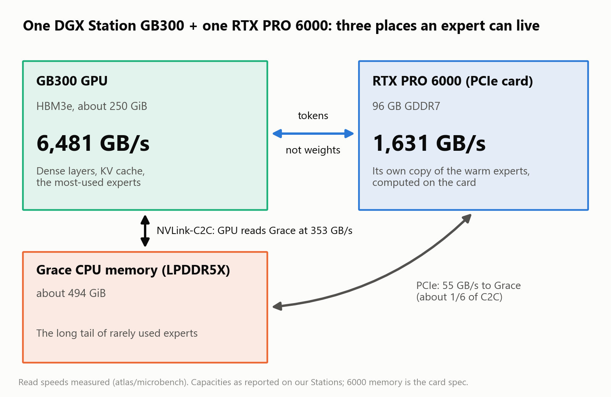
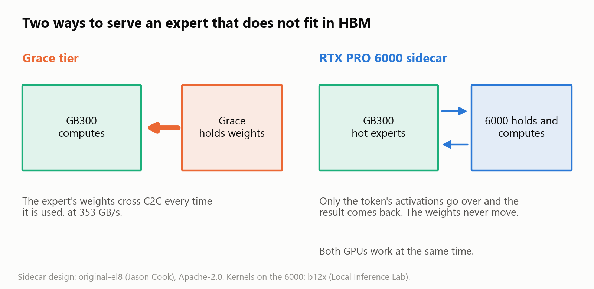
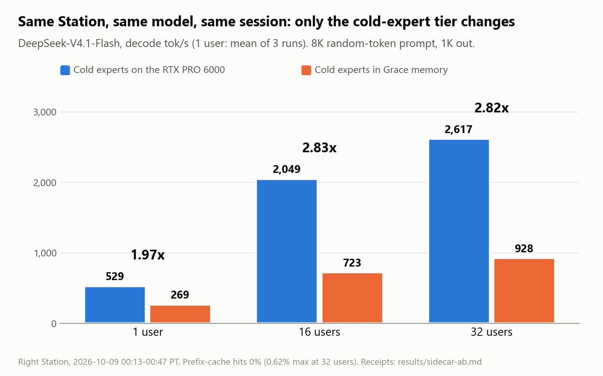

# Where should your experts live? Grace vs HBM vs RTX PRO 6000 on a DGX Station

*Stephen J. Ronan, MD ([@SJRonanMD](https://x.com/SJRonanMD)), October 2026. First published as an [X Article](https://x.com/SJRonanMD/status/2108589828896145869).*

On one DGX Station GB300, moving DeepSeek-V4.1-Flash's cold experts out of Grace memory and onto an RTX PRO 6000 doubled single-user speed (529 vs 269 decode tok/s) and nearly tripled it at 16 and 32 users. Same Station, same model, same session. The only change was where the cold experts lived.

If you own a Station, or are thinking about adding a 6000 to one, this is the decision that matters most for MoE models. Here is what each tier measured, why the 6000 wins, and where it stops helping.

## Why experts can live in different places

DeepSeek, Kimi, GLM and most big open models now are mixture-of-experts. Each layer has hundreds of small "expert" networks, and each token uses only a few of them. Some experts get picked far more often than others.

So you do not need every expert in your fastest memory. You need the busy ones there. The rest can sit somewhere slower, and the question is which "somewhere."

A Station gives you three choices.

- **GB300 HBM.** The memory on the GPU package. About 250 GiB, and it reads at 6,481 GB/s. Dense layers, the KV cache and the hottest experts go here.
- **Grace memory.** The CPU's LPDDR5X, about 494 GiB. The GPU can read it directly over NVLink-C2C at 353 GB/s. That sounds fast until you compare it with HBM: it is about 18 times slower per byte.
- **RTX PRO 6000.** A normal PCIe card with 96 GB of its own memory, read at 1,631 GB/s on the card. Its link back to Grace is only 55 GB/s, about a sixth of C2C.

## What we measured

We wrote small benchmarks for every path and ran them on one Station. Code and logs are in the repo.

Three things in that chart drive every placement decision:

**Pin your Grace memory.** The GPU reads pinned Grace memory at 353 GB/s. The same bytes as CUDA managed memory read at 91 GB/s, about a quarter of that. This is the easiest way to lose a Grace tier without noticing. If your offload path uses managed memory, fix that first.

**Do not let the Grace CPU do the math.** It is tempting: 72 Arm cores sitting right next to the memory. We timed one MoE expert both ways. The GB300 reading the weights over C2C and computing them was 6.9 to 7.6 times faster than the Grace CPU computing the same expert, from batch 1 to batch 64. CPU expert offload is a dead end on this machine.

**Never stream weights to the 6000.** Over PCIe the 6000 gets 55 GB/s pinned and 17 GB/s pageable. If the 6000 has to fetch weights from Grace, it loses to the GB300 reading them itself. The 6000 is only useful if the weights already live on it.

## Move tokens, not weights

That last point is the whole trick. When an expert sits in Grace, its weights have to cross C2C into the GPU every time a token uses it. Weights are big. Tokens are small.

The sidecar design flips it. The 6000 holds its own copy of a set of experts. When a token needs one of them, the GB300 sends the token's activations over, the 6000 computes the expert, and sends the result back. The weights never move, and both GPUs work at the same time.

The sidecar design is Jason Cook's (el8). He published it for DeepSeek-V4.1-Flash on one Station in September and showed it beating Grace: 1,154 vs 821 tok/s at 16 users. The kernels on the 6000 come from b12x by Local Inference Lab. Both are Apache-2.0. We added three things: it runs on public b12x code (his version needs an unreleased branch), a comparison where nothing changes except where the cold experts live, and power for both arms. In our runs the gap came out larger than his, 2.0x at one user and 2.8x at 16 and 32. Both our arms are faster than his too, which points to software differences we have not pinned down yet.

## The A/B

Arm A: DeepSeek-V4.1-Flash with hot experts in HBM (285 of 384 per layer) and the 99 cold experts per layer on the 6000. Arm B: the same hot experts in HBM, the same 99 cold experts read from pinned Grace memory instead. The 6000 sat empty.

Same container, same weights, same expert map, same server flags. Run back to back on the same Station on the night of October 8 to 9. 8K random-token prompts, 1K tokens out, a fresh seed per run.

- 1 user: 529 vs 269 decode tok/s, 1.97x (mean of 3 runs each)
- 16 users: 2,049 vs 723, 2.83x
- 32 users: 2,617 vs 928, 2.82x
- 64K-token prefill: 38.6K vs 26.5K tok/s, 1.46x

Prefill gains less because a long prompt batches its expert reads, so Grace's per-byte cost hurts it less than it hurts decode.

Power went up, but not by much. In the decode runs the GB300 averaged 496 W with the sidecar and 397 W without, and the 6000 added 145 W (it idles near 20 W when empty). At 16 and 32 users it draws about twice the GPU power for 2.8 times the speed, so 1.3 to 1.4 times more tokens per joule; at one user, 1.6 times the power for twice the speed.

A note on the numbers: "decode tok/s" leaves out the time spent reading the prompt. vLLM's "output tok/s," which includes it, reads lower: 474 vs 247 at one user, 1,739 vs 646 at 16 users. The ratios hold either way. Single-user runs swing about 10% between runs in arm A and 20% in arm B because of speculative decoding, which is why we report the mean.

## Where it pays less

The 6000 did the most here because DeepSeek-V4.1-Flash fits on one Station with the 6000 holding the whole cold tail. Every step touches that tail, so every step got faster.

On a model that does not fit, the picture changes. We ran DeepSeek-V4-Pro (1.6T parameters) across two Stations, with both 6000s holding the warmest experts that did not fit in HBM and Grace holding the rest. The 6000s raised 16-user throughput by 52% on real text and 39% on random tokens, with no quality cost. Single-user speed rose only 6 to 8%. At one user that model's step is dominated by hundreds of small kernels and the network between Stations, not by expert memory.

Two other limits:

- **Random-token benchmarks hide the effect.** Random tokens use every expert about equally, so any "put the busy experts in fast memory" map looks worse on them than on real traffic.
- **Usage maps come from your traffic.** Which experts are hot depends on what you send the model. Build the map from routing counts on your own workload.

## So where should your experts live?

My rule after four days of measuring:

1. Hottest experts, dense layers and KV cache in HBM.
2. If you have a 6000, give it a resident copy of the next tier and let it compute them. Send it tokens, never weights.
3. The long tail goes in pinned Grace memory, read by the GPU. Never managed memory, never CPU compute.

If your MoE model spills out of HBM and you serve more than one user, a 6000 in the open slot is the biggest single gain we have measured on one Station.

Every number above is in the public repo with its log, including the benchmark code and the settings we ran with:
[github.com/RonanLabsAI/dgx-station-frontier](https://github.com/RonanLabsAI/dgx-station-frontier)

Credit to Jason Cook (el8) for the sidecar design, Local Inference Lab for the b12x kernels, and catid for the benchmark shape we use so our numbers line up with his.

## Sources for every number

Rows are in [`results.jsonl`](../../results.jsonl); each row points at its log excerpt.

| Number in the article | Receipt |
|---|---|
| HBM 6,481 GB/s; Grace over C2C 353 GB/s (zero-copy 352.8, copy 353.6); managed 91 GB/s; Grace STREAM 305 GB/s | `atlas-hbm-read`, `atlas-c2c-zerocopy-read`, `atlas-c2c-h2d-pinned`, `atlas-managed-remote-read`, `atlas-grace-stream-triad` |
| RTX PRO 6000 on-card read 1,631 GB/s | [`logs/atlas-microbench/rtx-membench.log`](../../logs/atlas-microbench/rtx-membench.log) (`hbm_kernel_read_GBps 1630.6`) |
| 6000 to Grace over PCIe 55 / 17 GB/s | `atlas-rtx-h2d-pinned`, `atlas-rtx-h2d-pageable` |
| GPU reading Grace vs Grace CPU computing one expert, 6.9-7.6x | `atlas-expert-gpu-over-cpu-b1`, `-b16`, `-b64` |
| HBM about 250 GiB, Grace about 494 GiB, 72 Grace cores | [README hardware section](../../README.md#hardware) (256,703 MiB visible) |
| A/B decode 529 / 269, 2,049 / 723, 2,617 / 928; ratios 1.97x / 2.83x / 2.82x | `dsv41-ab-a-c1-decode-mean`, `dsv41-ab-b-c1-decode-mean`, `dsv41-ab-*-c16-decode`, `dsv41-ab-*-c32-decode`, `dsv41-ab-ratio-*-decode`; page: [`results/sidecar-ab.md`](../../results/sidecar-ab.md) |
| 64K prefill 38.6K / 26.5K, 1.46x | `dsv41-ab-a-prefill64k-c1`, `dsv41-ab-b-prefill64k-c1`, `dsv41-ab-ratio-prefill64k-c1` |
| Output tok/s 474 / 247, 1,739 / 646 | `dsv41-ab-*-c1-output-mean`, `dsv41-ab-*-c16-output` |
| Power 496 / 397 / 145 W, empty 6000 about 20 W; per-run power ratio 1.6x / 2.1x / 2.0x and 1.23x / 1.34x / 1.40x tokens per joule at 1 / 16 / 32 users | `dsv41-ab-a-gb300-power-mean-decode`, `dsv41-ab-b-gb300-power-mean-decode`, `dsv41-ab-a-rtx-power-mean-decode`, `dsv41-ab-b-rtx-power-mean-decode`; `dsv41-ab-ratio-c1-decode-tok-per-j-incl-idle-rtx` and the c16 / c32 tok/J rows (arm B counted with its idle RTX PRO 6000). Corrected 2026-10-09: the first version gave 1.5 to 1.6x power from window means over all runs, which holds only at 1 user |
| 285 hot / 99 cold experts per layer | [`results/sidecar-ab.md`](../../results/sidecar-ab.md) section 2 |
| DS-V4-Pro two Stations: +52% / +39% at 16 users, +8% / +6% at 1 user, quality | `dsv4pro-e3-vs-e2-real-c16`, `dsv4pro-e3-vs-e2-catid-c16`, `dsv4pro-sidecar-ab-real-c1-gain`, `dsv4pro-sidecar-ab-catid-c1-gain`, `dsv4pro-e2-gsm8k200`, `dsv4pro-e3a16-gsm8k200`, `dsv4pro-e3a16-flips` |
| el8's 1,154 vs 821 tok/s at 16 users | public: [original-el8/dgx-station-gb300-research](https://github.com/original-el8/dgx-station-gb300-research) `deepseek-v4.1-flash/m3/DETAILS.md`, runs `up-v20-peer2` (1,153.6) and `up-v20` (820.5). Not our measurement |

Figures: drawn from the values above. Cover art generated with Grok Imagine; title and numbers set by us.
